# 医疗手术机械臂原型机

## 技术文档


------


<div style="page-break-before: always;"></div>

[TOC]

#	一、项目摘要
##	1、技术指标要求
###	- 重量与尺寸
1.	设计需兼顾便携性、可靠性与功能性。
2.	总重量应 ≤ 1 kg。
3.	外形尺寸应满足：高度 ≤ 12 cm，长度 ≤ 8 cm，宽度 ≤ 5 cm。
### - 操作稳定性
1.	需具备抵消手抖或外部干扰的能力，确保操作稳定。
2.	系统对手柄动作的感知时间 ≤ 20 ms。
3.	姿态感知误差 ≤ 0.5°。
4.	输出端口处的角度误差 ≤ 1°。
5.	重复定位精度误差 ≤ 0.5°。
### - 运动自由度
1.	自由度不少于 4个。
2.	必须包括：俯仰、横滚、偏航三个维度的转动自由度，以及一个手术钳口张合自由度。
### - 运动范围要求
1.	横滚角调节范围 ≥ ±90° (双向总计不低于180°)。
2.	俯仰与偏航角调节范围均 ≥ ±45° (双向总计不低于90°)。  

## 2、样机数据
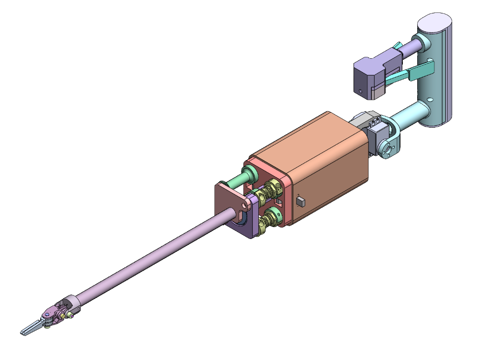   

###	- 重量
    总  重：682g
    操作钳：143g
    手  柄：539g
### - 尺寸
如下图   

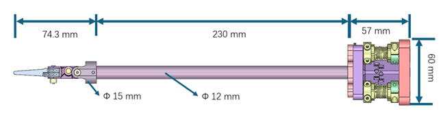   

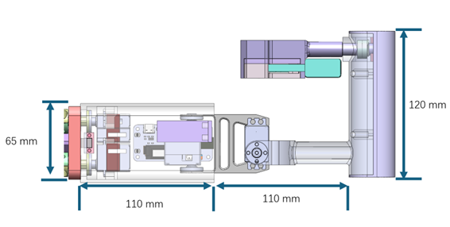   

### - 运动范围
    横滚（roll）：±120°
    俯仰 (pitch)：±60°
    偏航 (yaw)：±60°
    钳口开合的自由度由偏航角覆盖完成
### 定位精度
    前部驱动电机：FT-STS3032内置高性能mcu驱动，14bit磁绝对值编码器，精度0.088°
    后部操作输入&维稳电机：FT-STS3009内置高性能mcu驱动14bit磁绝对值编码器，精度0.088°
    捏合、旋转输入：as5600绝对值编码器，精度0.088°
# 二、版本迭代
## 方案 1.0
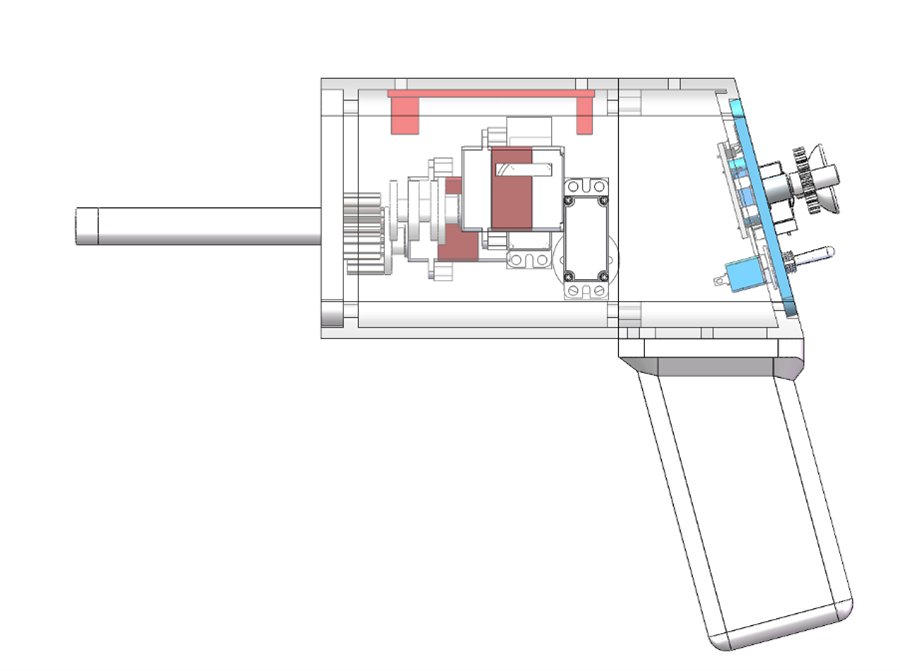
-	将操作方式主要集中于拇指和食指
-	拇指操控摇杆进行钳头的偏航和俯仰
-	波轮旋转对应钳头的横滚
-	食指扳机对应钳头的开合
-	内置电池放置在手柄底部
## 方案 1.1
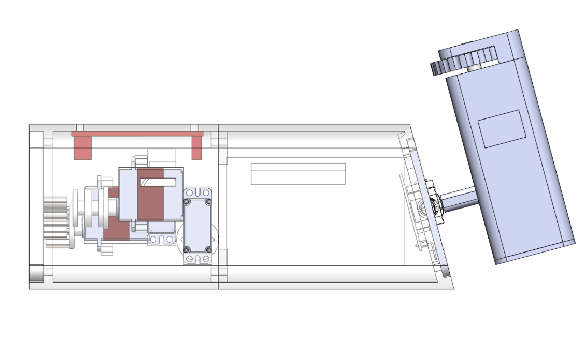
-	 钳头的偏航和俯仰改为用腕部输入的方式
-	钳头的横滚改为用食指、拇指的滚轮
-	钳头的开合改为按键
-	将内置电池移到主体内部，加长主体长度
##	方案 1.2
 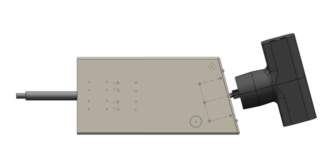
-	加入快换功能
-	鉴于之前遥杆的扭力不足，换成3轴大尺寸遥杆
-	钳头的横滚、偏航和俯仰均使用手腕输入
-	钳头的开合按钮移动至握持手柄的顶部
##	方案 2.0
 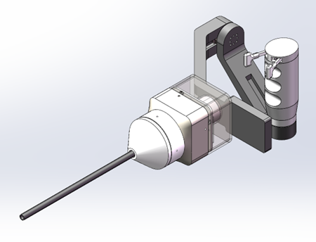
-	改用云台手柄输入，确保主体能在空间中保持稳定
-	钳口捏合改为食指拇指捏合输入
-	为减小总体体积，快拆模式改为前部旋转切换
-	输入电机为海泰ht2205
-	输出电机为海泰ht1105
##	方案 2.1
 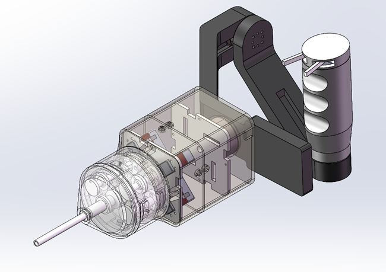
-	输出电机改回飞特sts3032
-	优化电机排布方案
-	改回外部供电方案
##	方案 3.0
 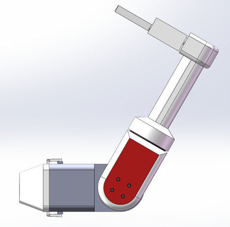
-	握持方式改为提手式，取消云台输入
-	快拆结构改为直插锁扣设计，取消旋转快拆结构
## 方案 3.1
 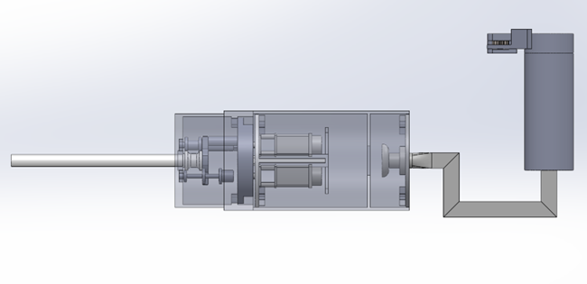
-	取消提手式握持，改回手腕输入
-	取消飞特电机，改为无刷电机+减速齿轮组
-	取消卡扣式锁定，改为直插+旋转锁定
##	方案 3.2
 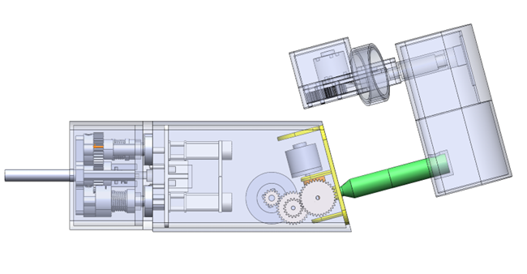
-	放弃圆形主体结构，改回方体结构
-	输入模式改为腕部控制钳口的俯仰和偏航
-	捏合处额外放置一块ht1105电机用于提供夹持力反馈
-	捏合输入与横滚输入合并到同一输入轴
-	腕部输入改为利用齿轮组和无刷电机记录角度变化并提供自稳功能
-	快拆部分改为直插＋内部锁定，取消螺纹自锁结构
##	方案 3.3
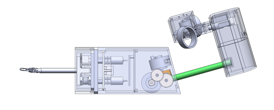 
-	因电机易于过热，放弃海泰1105无刷电机，改为双ht2205电机保持自稳
-	进一步缩短前部绕线轴长度
-	自设计、焊接定制电路板用于前部无刷电机的驱动，减小体积
-	自设计、焊接定制电路板用于总控前部驱动、后部横滚、捏合、俯仰、偏航的稳定控制
-	自设计钳头的钢丝走向、固定方式
##	法国dex钳口设计
 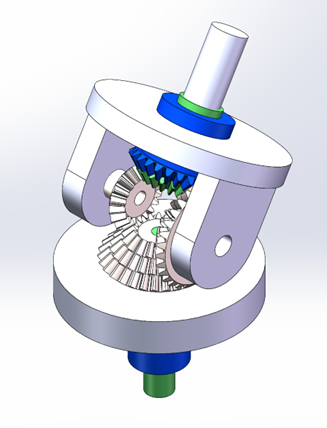
-	基于dex官网视频和简介，还原3组锥齿轮驱动结构
-	鉴于加工难度，放弃进一步推进
##	方案 4.0
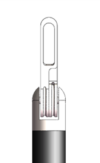
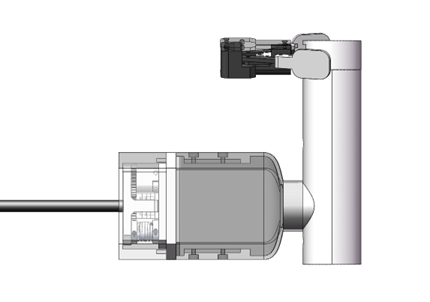
-	放弃俯仰、偏航两个自由度的输入与控制，简化为开合和旋转。缺少的自由度有握持者腕部自提供
-	放弃捏合部分的电机力反馈功能，改为单独的齿轮联动+磁铁传感器
-	提供简易版模拟操作功能视频 
##	方案 4.1
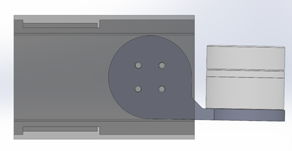
-	重新加入俯仰、横滚的功能设计
-	改用ht2805大扭矩电机直接驱动，放弃齿轮减速组+小体积设计
##	方案 5.0
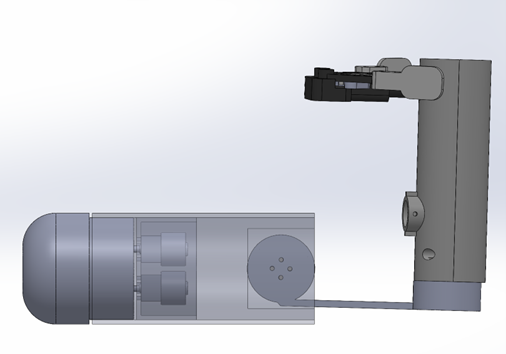
-	基于方案4.1的设计，将前部无刷电机改为步进电机
-	基于新的尺寸定制磁编码器电路板
-	将偏航控制移动到手柄端
-	基于体积控制考虑，将主体和快拆修改为圆柱体
##	方案 5.1
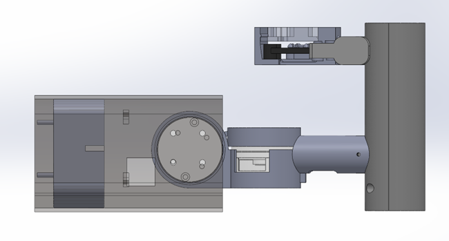
-	基于方案5.0，改用HT2806电机
-	缩短手柄到主体的距离，减轻电机负担
-	基于后续显示屏设计，将主体上半改为平面
##	方案 5.2
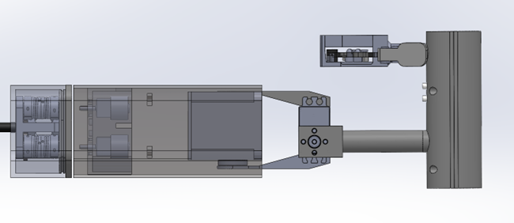
-	将腕部输入维稳的ht2806电机更换为飞特STS3009
-	在手柄处加入两个按键用于一键完成特定组合功能
-	重新设计手柄处旋转、捏合的信号采集，并绘制新的电路板
##	方案-飞特 1.0
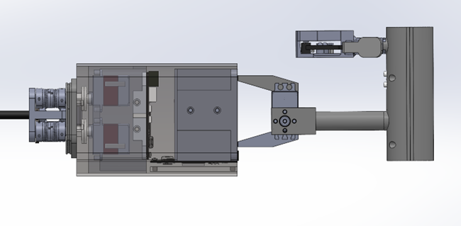
-	修改偏航电机与主体的固定方式
-	将前部驱动电机由无刷电机改回飞特STS3032
-	将主体由细长改为短粗，减小体积
-	重新设计主控电路的位置，完成电路设计
-	前部快拆设计改为底部卡扣、上部螺丝设计
##	方案-飞特 2.0
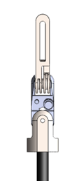
-	重新修改钳口，减小摩擦
-	重新修改绕线轮设计，完善钢丝上紧功能
-	修改主控电路板，简化空间占用
-	修改偏航、俯仰维稳电机的固定方式，增强强度
-	修改捏合手柄的回弹方式
##	方案-飞特 3.0
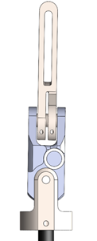 
-	修改钳口走线方式，减小脱线概率
-	CNC加工关键零部件测试
-	修改底部绕线轮设计，改用单向轴承提供对向张紧力
-	修改主体电路板、电机排布设计，缩小体积
##	方案-飞特 4.0
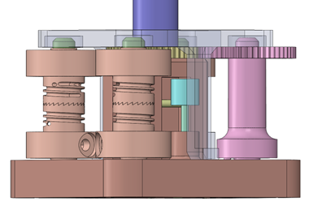
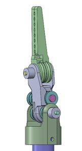 
-	放弃单向轴承方案，改用棘轮结构维持对向绕线轮运动过程中的张力与相对静止
-	修改钳头设计，减少摩擦阻力
-	修改底部快拆绕线部分的走线设计，减小钢丝与非光虎平面的摩擦
-	主体添加弹簧按扣用于快拆模块的固定与拆卸
##	方案-飞特 4.1
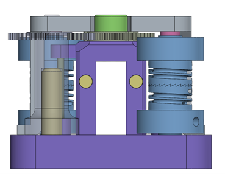
-	修改快拆底部垂直折角出的销钉固定方式
-	修改绕线轮与转轴的固定方式
#	三、样机组装流程
（如未做额外说明，则默认单位为毫米（mm），零件名称后的括号代表对应的零件编号）
##	1、钳头组装
1.	准备四根长度40cm的φ0.5的钢丝。
2.	分别将两根钢丝穿过钳头（P002），用对应的铝套紧固。
3.	将钳头（P002）用φ2*16插销插入钳头中座（P003），并用φ2的光轴固定器固定
4.	将剩余的两根钢丝用铝套固定到钳头中座的中部孔槽中，并将对应的轴承（ID2 OD5 T1.5）和轴承导线环（P004）用阶梯螺丝（P005）固定。
5.	将完成好的钳头中座和钳头，和对应的轴承（ID2 OD5 T1.5）和轴承导线环（P004）用φ2*25的插销固定到钳头基座（P001）并φ2的光轴固定器紧固。
6.	6根不锈钢管（ID1.1 OD1.5）用涂胶的方式固定在钳头基座的底座，将六根钢丝穿过对应的钢管
vii.	将碳管（ID10 OD12）穿过六根不锈钢管后，组装到钳头基座，并用m3螺丝紧固
##	2、绕线轮组
1.	将四根绕线轴（P009）放置在安装基座（P022）上后放置绕线基座（P011）
2.	在绕线基座、绕线中座（P013）、绕线盖（P021）上放置轴承（ID6 OD10 T3）后，将绕线轮（P012&P019）两两一组放置到对应位置。
3.	将碳管的另一端穿过绕线组盖（P021）、固定到被驱动齿轮（P014）并用M3机米紧固。
4.	将轴承（ID17 OD23 T4）的轴承安装到绕线中座（P013）后，先将六根钢丝穿到绕线中座对应的孔位后，插入m2*8的销钉，并用m3*14的螺丝紧固绕线中座和底座。
5.	将对应的6根钢丝穿入对应的绕线轮组后，预留35mm的长度后用铝套紧固并裁去多余钢丝。
6.	将驱动齿轮（P017）用m3机米紧固到对应的运动轴上，并用m3*5螺丝拧紧绕线盖
7.	用配套的扭力扳手替换头（P023）、扭力扳手、m3内六角螺丝刀，将六根钢丝紧固到各自的运动轴上，扭力预设3N.m.
##	3、手柄组装
1.	用m2*4的螺丝将捏合柄（P026）固定到捏合基座（P025）上，然后在中间放置扭力弹簧（弹簧参数由使用者确定手感，对操控无影响），并将φ6 t3径向磁铁粘合到右侧手柄后，用m2沉头螺丝捏合盖（P028）。
2.	将轴承（ID10 OD 15 T4）的轴承放入手柄（P029）后，将捏合部分（A004）插入轴承孔后用卡扣（P035）紧固。
3.	将AS5600编码器电路板（P030）用m1.2螺丝紧固到捏合手柄（P029）上，先将捏合手柄安装到手柄（P031）后，再将控制线穿孔而过。
4.	将AS5600电路板固定到卡槽（P033）上后，插入捏合手柄，用m2螺丝拧紧后盖（P034）
##	4、主体组装
1.	先将4个STS3032电机（P037）的电源信号线串并联到控制板（P041）上，然后用m2.5*10的螺丝将4个电机组装到主体（P046）。
2.	将两根STS3009用m4螺丝固定到手柄连接件（P040）和手柄（P29）后，将控制线连接到主控板（P041）
3.	将STS3009固定到电机卡槽（P42）后，插入主体（P046），接入电源，完成组装
# 四、电路控制&算法
该项目为实现类似于达芬奇的手术机械臂夹爪的效果，夹爪硬件采用3个自由度的机械臂加一个夹爪开合的自由度设计，系统输入为手柄给定3个旋转关节的角度和一个夹爪开合的角度。系统机械臂的实际自由度只有3个，故不能实现绕任意给定的方向旋转，给定方向意味着3个自由度，而且稳定位置也是3个自由度，系统超定。达芬奇的实现是采用大臂带动小臂协同运动，实现6自由度的增稳控制。该项目的硬件约束故不考虑该情况的实现。现在介绍整体的解藕设计，首先定义坐标系如下：
采用欧拉角描述对应姿态，则输入姿态与输出姿态线型映射即可。具体实现代码见后文，环境采用Arduino，依赖库环境FTServo (舵机驱动库), FastLED (总线式LED驱动，可选)。舵机采用位置模式，最大力矩和最大加速度见每个舵机的配置，使用飞特的上位机即可查看。

## 1、完整的坐标系建立与 D-H 参数 (Denavit-Hartenberg)
根据机械臂结构图，采用标准 D-H 方法建立坐标系:  

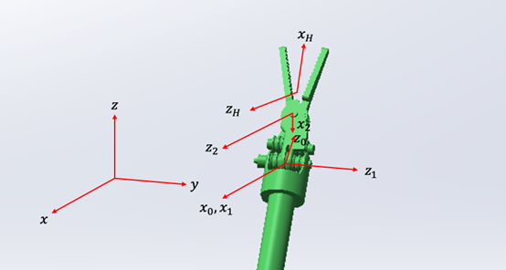    

该机械臂由三个旋转关节组成，其核心设计参数如下表：  

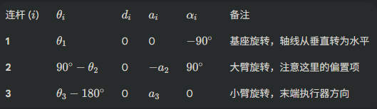   

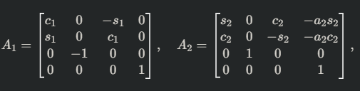   

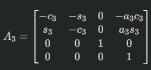    

##	2、末端位置表达式 (Position)与旋转矩阵
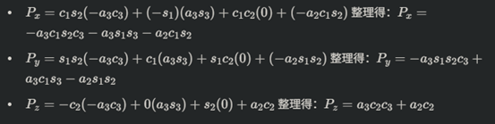 
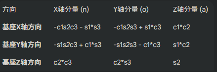 


## 3、完整代码
```cpp
// ESP32 Dev Module
#include <SCServo.h>
#include <HardwareSerial.h>
#include <FastLED.h>

HardwareSerial SerialServo(1); // UART1
SMS_STS sms_sts;

#define LED_PIN  23     // WS2812 pin
#define S_RXD 18
#define S_TXD 19
#define NUM_LEDS 12      // num of LED
// #define DEBUGINFO

CRGB leds[NUM_LEDS];

const int NUM_SERVO = 8;
int ID[NUM_SERVO]       = {1, 2, 3, 4, 5, 6, 7, 8};
int Pos[NUM_SERVO];
int Speed[NUM_SERVO];
int Load[NUM_SERVO];
int Voltage[NUM_SERVO];
int Temper[NUM_SERVO];
int Move[NUM_SERVO];
int Current[NUM_SERVO];

byte ControlID[4]      = {1,2,3,4};

bool lock_flag = false;
bool unload_flag = false;
const float gripper_open = 5.0;
#define LOCK

uint8_t cmd_buf[8];
int buildSMSWriteCmd(uint8_t id, uint8_t cmd, uint8_t* out_buf) {
    // Serial Protocol: 0 -> unload; 1 -> enable; 128 -> 2048 calibration when in position mode
    out_buf[0] = 0xFF;           // head
    out_buf[1] = 0xFF;           // head
    out_buf[2] = id;             // Servo ID
    out_buf[3] = 0x04;           // Length
    out_buf[4] = 0x03;           // Instructuion
    out_buf[5] = 0x28;           // Reginster
    out_buf[6] = cmd;            // Cmd
    uint8_t check = ~(id + 0x04 + 0x03 + 0x28 + cmd) & 0xFF;
    out_buf[7] = check;
    return 8;
}

void setAllLED(CRGB color) {
    for (int i = 0; i < NUM_LEDS; ++i) leds[i] = color;
    FastLED.show();
}

void setup()
{
    SerialServo.begin(500000, SERIAL_8N1, S_RXD, S_TXD);
    sms_sts.pSerial = &SerialServo;
    Serial.begin(115200);

    delay(1000);

    FastLED.addLeds<WS2812, LED_PIN, GRB>(leds, NUM_LEDS);
    FastLED.clear();
    FastLED.show();

    sms_sts.WritePosEx(ID[5-1], 2048, 0, 0);
    sms_sts.WritePosEx(ID[6-1], 2048, 0, 0);
    delay(2000);
}

void loop()
{
    // Step 1: feedback of 8 servos
    for (int i = 0; i < NUM_SERVO; ++i) {
        sms_sts.FeedBack(ID[i]);
        if(!sms_sts.getLastError()){
            Pos[i]     = sms_sts.ReadPos(-1);
            Speed[i]   = sms_sts.ReadSpeed(-1);
            Load[i]    = sms_sts.ReadLoad(-1);
            Voltage[i] = sms_sts.ReadVoltage(-1);
            Temper[i]  = sms_sts.ReadTemper(-1);
            Move[i]    = sms_sts.ReadMove(-1);
            Current[i] = sms_sts.ReadCurrent(-1);
            if(i == 6)
            {
              Serial.print("ID:"); Serial.print(ID[i]);
              Serial.print(" Pos:"); Serial.println(Pos[i]);
            }
            #ifdef DEBUGINFO
                Serial.print("ID:"); Serial.print(ID[i]);
                Serial.print(" Pos:"); Serial.print(Pos[i]);
                Serial.print(" Speed:"); Serial.print(Speed[i]);
                Serial.print(" Load:"); Serial.print(Load[i]);
                Serial.print(" V:"); Serial.print(Voltage[i]);
                Serial.print(" T:"); Serial.print(Temper[i]);
                Serial.print(" Move:"); Serial.print(Move[i]);
                Serial.print(" Current:"); Serial.println(Current[i]);
            #endif
        } else {
            Serial.print("FeedBack error for ID: "); Serial.println(ID[i]);
            Pos[i] = -1;
            setAllLED(CRGB(255, 0, 0));
            exit(-1);
        }
    }

    // Step 2: hand cmd
    int p5, p6, p7, p8, mid;
    p5 = Pos[4];
    p6 = Pos[5];
    p7 = Pos[6];
    p8 = Pos[7];
    mid = 2048;
    float roll_cmd, pitch_cmd, yaw_cmd, gripper_cmd; // map from hand
    float roll_in, pitch_in, yaw_in;    // trans hand cmd to servo inputs

    roll_cmd  = -(p8 - mid) / 4096.0 * 360.0;
    pitch_cmd =  (p6 - mid) / 4096.0 * 360.0 * 1.5;
    yaw_cmd   = -(p5 - mid) / 4096.0 * 360.0 * 6.0 ;

    gripper_cmd = -(p7 - mid) / 4096.0 * 360.0 * 1.5;

    // Step 3: RPY of the center of gripper
    roll_in  = 65   / 35.0 * roll_cmd;
    pitch_in = 4.5  / 5.5  * pitch_cmd;
    yaw_in   = 5.15 / 5.5  * yaw_cmd + 3.25 / 5.5 * pitch_cmd;

    // Step 4: calculate servo cmd
    int s1_pitch, s2_roll, s3_yaw_right, s4_yaw_left; 
    const int s1_phase = -1, s2_phase = 1, s3_phase = -1, s4_phase = 1;
    const float gripper_range = 30.0;
    s1_pitch     = int(s1_phase * pitch_in / 360.0 * 4096.0 + 2048.0);
    s2_roll      = int(s2_phase * roll_in  / 360.0 * 4096.0 + 2048.0);
    s3_yaw_right = int(s3_phase * (yaw_in - gripper_cmd + gripper_range)  / 360.0 * 4096.0 + 2048.0);
    s4_yaw_left  = int(s4_phase * (yaw_in + gripper_cmd*1.2 - gripper_range)  / 360.0 * 4096.0 + 2048.0);

    // Step 5: Run servo
    #ifdef LOCK
    if(gripper_cmd > gripper_open)
    {
        if(!unload_flag)
        {
            buildSMSWriteCmd(ID[5-1], 0, cmd_buf);
            SerialServo.write(cmd_buf, 8);
            delay(1);
            buildSMSWriteCmd(ID[6-1], 0, cmd_buf);
            SerialServo.write(cmd_buf, 8);
            delay(1);
            unload_flag = true;
        }
        sms_sts.WritePosEx(ID[1-1], s1_pitch,     0, 0);
        sms_sts.WritePosEx(ID[2-1], s2_roll,      0, 0);
        sms_sts.WritePosEx(ID[3-1], s3_yaw_right, 0, 0);
        sms_sts.WritePosEx(ID[4-1], s4_yaw_left,  0, 0);
        lock_flag = false;
    }
    else
    {
        if(!lock_flag)
        {
            buildSMSWriteCmd(ID[5-1], 1, cmd_buf);
            SerialServo.write(cmd_buf, 8);
            delay(1);
            buildSMSWriteCmd(ID[6-1], 1, cmd_buf);
            SerialServo.write(cmd_buf, 8);
            delay(1);
            for(int i = 0; i < 6; i++)
                sms_sts.WritePosEx(ID[i], Pos[i],  0, 0);
            lock_flag = true;
        }
        unload_flag = false;

    }

    #else
    sms_sts.WritePosEx(ID[1-1], s1_pitch,     0, 0);
    sms_sts.WritePosEx(ID[2-1], s2_roll,      0, 0);
    sms_sts.WritePosEx(ID[3-1], s3_yaw_right, 0, 0);
    sms_sts.WritePosEx(ID[4-1], s4_yaw_left,  0, 0);
    #endif
    
    // rate control
    delay(3);
}

// update library link
// https://raw.githubusercontent.com/espressif/arduino-esp32/gh-pages/package_esp32_index.json
```
#	五、图纸&模型
##	3d模型
-	模型基于树脂打印，预设打印精度±0.1mm
-	基于工艺不同，需要重新调整预设公差
##	CNC加工
-	预设最严公差为GB/T 1804-2000 m级
-	加工时以3d图纸为准，2d图纸仅标注关键尺寸以及螺纹孔尺寸
